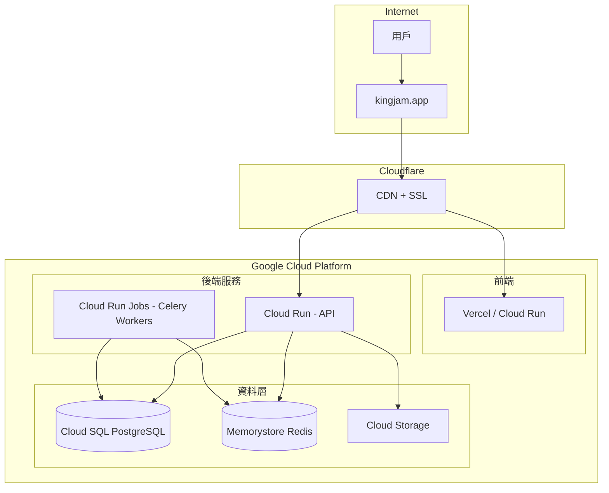

# King Jam AI 正式上線部署計畫

## 部署架構



## 第一階段：GCP 基礎設施準備

### 1.1 啟用必要的 GCP API

```bash
gcloud services enable \
  run.googleapis.com \
  sqladmin.googleapis.com \
  redis.googleapis.com \
  cloudbuild.googleapis.com \
  secretmanager.googleapis.com \
  storage.googleapis.com \
  artifactregistry.googleapis.com
```

### 1.2 建立 Cloud SQL 執行個體

- **執行個體名稱**: `kingjam-db`
- **資料庫版本**: PostgreSQL 15
- **區域**: `asia-east1` (台灣)
- **機器類型**: `db-f1-micro` (開始) 或 `db-custom-1-3840` (正式)
- **儲存空間**: 10GB SSD，自動擴充

### 1.3 建立 Memorystore Redis

- **執行個體名稱**: `kingjam-redis`
- **容量**: 1GB Basic
- **區域**: `asia-east1`

### 1.4 建立 Cloud Storage 儲存桶

- **名稱**: `kingjam-uploads`
- **位置**: `asia-east1`
- **用途**: 用戶上傳檔案、生成的影片

## 第二階段：後端部署準備

### 2.1 建立生產環境 Dockerfile

需要修改 [backend/Dockerfile](backend/Dockerfile)，移除開發模式設定：

```dockerfile
FROM python:3.10-slim

WORKDIR /app

ENV PYTHONDONTWRITEBYTECODE 1
ENV PYTHONUNBUFFERED 1

RUN apt-get update \
    && apt-get install -y --no-install-recommends gcc libpq-dev ffmpeg curl \
    && apt-get clean \
    && rm -rf /var/lib/apt/lists/*

COPY requirements.txt .
RUN pip install --no-cache-dir -r requirements.txt

COPY . .

# 生產環境啟動（移除 --reload）
CMD exec gunicorn --bind :$PORT --workers 2 --threads 4 --timeout 120 -k uvicorn.workers.UvicornWorker app.main:app
```

### 2.2 新增 gunicorn 到 requirements.txt

在 [backend/requirements.txt](backend/requirements.txt) 加入：

```
gunicorn>=21.0.0
```

### 2.3 建立 Secret Manager 密鑰

需要儲存的敏感資訊：

- `DATABASE_URL` - Cloud SQL 連線字串
- `SECRET_KEY` - JWT 密鑰
- `REDIS_URL` - Memorystore 連線
- `GOOGLE_CREDENTIALS` - Google OAuth 金鑰
- `ECPAY_HASH_KEY` / `ECPAY_HASH_IV` - 綠界金流
- `SENDGRID_API_KEY` - 郵件服務（如使用）

## 第三階段：Cloud Run 部署

### 3.1 部署後端 API

```bash
gcloud run deploy kingjam-api \
  --source ./backend \
  --region asia-east1 \
  --platform managed \
  --allow-unauthenticated \
  --set-env-vars "ENVIRONMENT=production" \
  --add-cloudsql-instances PROJECT_ID:asia-east1:kingjam-db \
  --memory 1Gi \
  --cpu 1 \
  --min-instances 1 \
  --max-instances 10 \
  --timeout 300
```

### 3.2 部署 Celery Workers（使用 Cloud Run Jobs）

建立 `cloudbuild-worker.yaml` 用於定時執行 Celery 任務。

## 第四階段：前端部署

### 4.1 Vercel 部署（推薦）

1. 連接 GitHub 倉庫的 `frontend` 資料夾
2. 設定環境變數：

   - `NEXT_PUBLIC_API_URL=https://api.kingjam.app`
   - `NEXT_PUBLIC_SITE_URL=https://kingjam.app`

### 4.2 或使用 Cloud Run 部署前端

需要在 frontend 資料夾建立 Dockerfile。

## 第五階段：網域配置

### 5.1 Cloudflare DNS 設定

| 類型 | 名稱 | 值 | Proxy |

|------|------|-----|-------|

| CNAME | @ | [Vercel 網址] | 開啟 |

| CNAME | www | kingjam.app | 開啟 |

| CNAME | api | [Cloud Run 網址] | 開啟 |

### 5.2 Cloud Run 網域對應

```bash
gcloud run domain-mappings create \
  --service kingjam-api \
  --domain api.kingjam.app \
  --region asia-east1
```

## 第六階段：環境變數完整清單

### 後端環境變數 (Cloud Run)

```env
# 資料庫
DATABASE_URL=postgresql://kingjam:PASSWORD@/kingjam_db?host=/cloudsql/PROJECT:asia-east1:kingjam-db

# 安全
SECRET_KEY=your-production-secret-key-min-32-chars
ENVIRONMENT=production

# Redis
REDIS_URL=redis://REDIS_IP:6379/0
CELERY_BROKER_URL=redis://REDIS_IP:6379/0
CELERY_RESULT_BACKEND=redis://REDIS_IP:6379/1

# 金流
PAYMENT_MODE=production
ECPAY_MERCHANT_ID=正式商店代號
ECPAY_HASH_KEY=正式HashKey
ECPAY_HASH_IV=正式HashIV

# 郵件
EMAIL_PROVIDER=sendgrid
SENDGRID_API_KEY=SG.xxx
SENDGRID_FROM_EMAIL=service@kingjam.app

# OAuth
GOOGLE_CLIENT_ID=xxx.apps.googleusercontent.com
GOOGLE_CLIENT_SECRET=xxx
FACEBOOK_APP_ID=xxx
FACEBOOK_APP_SECRET=xxx

# 前端 URL
FRONTEND_URL=https://kingjam.app
BACKEND_URL=https://api.kingjam.app
```

## 第七階段：上線前檢查清單

- [ ] Cloud SQL 執行個體建立完成
- [ ] 資料庫遷移執行完成
- [ ] Memorystore Redis 建立完成
- [ ] Cloud Storage 儲存桶建立完成
- [ ] Secret Manager 密鑰設定完成
- [ ] Cloud Run API 部署成功
- [ ] 網域 DNS 設定完成
- [ ] SSL 證書生效
- [ ] Google OAuth 回調網址更新
- [ ] Facebook OAuth 回調網址更新
- [ ] ECPay 正式環境回調網址設定
- [ ] 郵件服務測試通過
- [ ] 付款流程測試通過
- [ ] 社群登入測試通過

## 預估費用（每月）

| 服務 | 規格 | 預估費用 |

|------|------|---------|

| Cloud SQL | db-f1-micro | ~$10 |

| Memorystore | 1GB Basic | ~$35 |

| Cloud Run | 1vCPU, 1GB | ~$30-50 (依流量) |

| Cloud Storage | 10GB | ~$0.5 |

| **總計** | | **~$75-100/月** |

## 需要您提供的資訊

1. GCP 專案 ID
2. 綠界正式環境帳號資訊（商店代號、HashKey、HashIV）
3. SendGrid API Key（或選擇其他郵件服務）
4. 確認是否使用 Vercel 部署前端